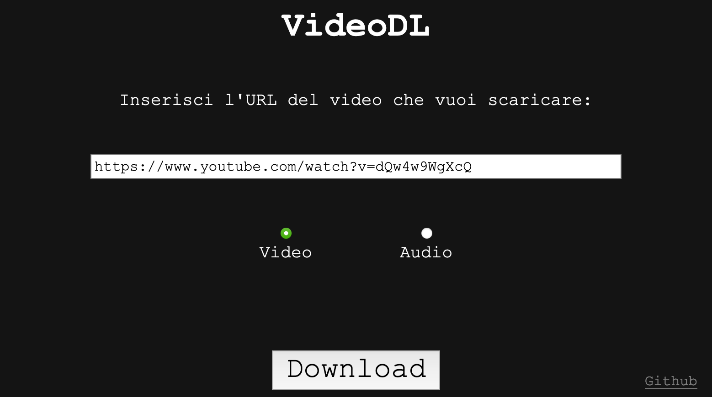

# VideoDL

</img>

# 🇮🇹

Applicazione node.js e sito web minimali per scaricare video e audio da una pagina web tramite l'URL.

Il server richiede che `youtube-dl` e `ffmpeg` siano installati. Inoltre, la pagina web deve essere servita con HTTPS.

È necessario anche creare un file chiamato `hashedpassword.txt` vicino a `server.js` contenente l'hash SHA256 della password richiesta per utilizzare il sito web.

Dopo aver inserito la password, essa verrà salvata in un cookie e quindi non verrà più richiesta.

### COME AVVIARE:
- Andare nella cartella del progetto con `cd`.
- Eseguire `npm install` per scaricare le dipendenze richieste dal server.
- Eseguire `node server.js` per avviare il server.
- Se `forever` è installato globalmente (con `npm install -g forever`), è possibile avviare il server con `npm run start`.

### DA FARE:
- Fare in modo che il client, invece di salvare la password hashata nel cookie, salvi un token generato dal server, il quale tiene tracca di quali token ha generato e quali sono ancora validi.

# 🇬🇧

Minimal node.js application & website to download video and audio files from the URL of an internet webpage.

The server requires `youtube-dl` and `ffmpeg` to be installed and the webpage has to be served over HTTPS.

You also need to create a file named `hashedpassword.txt` near `server.js` containing the SHA256 of a password you want to use to access the website.

After you enter the password, it will be stored in a cookie so it won't ask you again for it.

### HOW TO START:
- `cd` into the project directory.
- Run `npm install` to download the required dependencies.
- Run `node server.js` to start the server.
- If `forever` is globally installed (`npm install -g forever`), it's possible to start the server running `npm run start`.

### TODO:
- Make so that the client doesn't save the hashed password in the cookie but it saves a unique token generated by the server, who keeps track of which tokens it generated and which ones are still valid.
